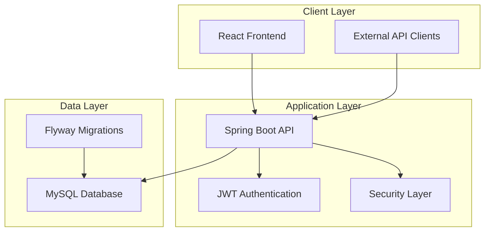
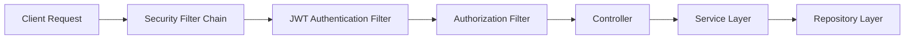
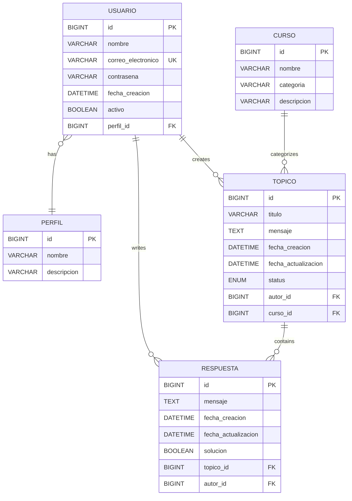

# Design Document

## Overview

ForoHub API is a REST API built with Spring Boot 3 and Java 17, designed as a containerized microservice architecture. The system implements a layered architecture pattern with clear separation of concerns, following Domain-Driven Design principles. The API provides secure forum functionality with JWT-based authentication, comprehensive topic and response management, and OWASP ASVS Level 1 security compliance.

## Architecture

### High-Level Architecture

The system follows a containerized microservice architecture with three main components:



### Layered Architecture Pattern

The Spring Boot application implements a clean layered architecture:

1. **Controller Layer**: REST endpoints, request/response handling, validation
2. **Service Layer**: Business logic, transaction management, security enforcement
3. **Repository Layer**: Data access abstraction using Spring Data JPA
4. **Entity Layer**: Domain models and database mappings

### Security Architecture



## Components and Interfaces

### Core Entities

#### User Entity
```java
@Entity
public class Usuario {
    @Id @GeneratedValue
    private Long id;
    
    @NotBlank @Size(max = 100)
    private String nombre;
    
    @Email @NotBlank @Column(unique = true)
    private String correoElectronico;
    
    @NotBlank
    private String contrasena; // BCrypt hashed
    
    @ManyToOne
    private Perfil perfil;
    
    @CreationTimestamp
    private LocalDateTime fechaCreacion;
    
    private Boolean activo = true;
}
```

#### Topic Entity
```java
@Entity
public class Topico {
    @Id @GeneratedValue
    private Long id;
    
    @NotBlank @Size(max = 200)
    private String titulo;
    
    @NotBlank @Size(max = 2000)
    private String mensaje;
    
    @CreationTimestamp
    private LocalDateTime fechaCreacion;
    
    @UpdateTimestamp
    private LocalDateTime fechaActualizacion;
    
    @Enumerated(EnumType.STRING)
    private StatusTopico status = StatusTopico.ABIERTO;
    
    @ManyToOne @JoinColumn(name = "autor_id")
    private Usuario autor;
    
    @ManyToOne @JoinColumn(name = "curso_id")
    private Curso curso;
    
    @OneToMany(mappedBy = "topico", cascade = CascadeType.ALL)
    private List<Respuesta> respuestas = new ArrayList<>();
}
```

#### Response Entity
```java
@Entity
public class Respuesta {
    @Id @GeneratedValue
    private Long id;
    
    @NotBlank @Size(max = 2000)
    private String mensaje;
    
    @CreationTimestamp
    private LocalDateTime fechaCreacion;
    
    @UpdateTimestamp
    private LocalDateTime fechaActualizacion;
    
    @ManyToOne @JoinColumn(name = "topico_id")
    private Topico topico;
    
    @ManyToOne @JoinColumn(name = "autor_id")
    private Usuario autor;
    
    private Boolean solucion = false;
}
```

### DTOs (Data Transfer Objects)

#### Authentication DTOs
```java
public record RegistroUsuarioDTO(
    @NotBlank @Size(max = 100) String nombre,
    @Email @NotBlank String correoElectronico,
    @NotBlank @Size(min = 6, max = 100) String contrasena
) {}

public record LoginDTO(
    @Email @NotBlank String correoElectronico,
    @NotBlank String contrasena
) {}

public record TokenDTO(String token, String tipo, Long expiracion) {}
```

#### Topic DTOs
```java
public record CrearTopicoDTO(
    @NotBlank @Size(max = 200) String titulo,
    @NotBlank @Size(max = 2000) String mensaje,
    @NotNull Long cursoId
) {}

public record TopicoResponseDTO(
    Long id,
    String titulo,
    String mensaje,
    LocalDateTime fechaCreacion,
    StatusTopico status,
    String autorNombre,
    String cursoNombre,
    Integer totalRespuestas
) {}

public record DetalleTopicoDTO(
    Long id,
    String titulo,
    String mensaje,
    LocalDateTime fechaCreacion,
    LocalDateTime fechaActualizacion,
    StatusTopico status,
    UsuarioDTO autor,
    CursoDTO curso,
    List<RespuestaDTO> respuestas
) {}
```

### Service Layer Interfaces

#### Authentication Service
```java
@Service
public interface AuthenticationService {
    TokenDTO registrarUsuario(RegistroUsuarioDTO dto);
    TokenDTO autenticarUsuario(LoginDTO dto);
    void validarToken(String token);
    Usuario obtenerUsuarioActual();
}
```

#### Topic Service
```java
@Service
public interface TopicoService {
    Page<TopicoResponseDTO> listarTopicos(Pageable pageable);
    DetalleTopicoDTO obtenerTopicoPorId(Long id);
    TopicoResponseDTO crearTopico(CrearTopicoDTO dto, Usuario autor);
    TopicoResponseDTO actualizarTopico(Long id, ActualizarTopicoDTO dto, Usuario autor);
    void eliminarTopico(Long id, Usuario autor);
    Page<TopicoResponseDTO> listarTopicosPorAutor(Usuario autor, Pageable pageable);
}
```

### Repository Layer

```java
@Repository
public interface TopicoRepository extends JpaRepository<Topico, Long> {
    Page<Topico> findAllByOrderByFechaCreacionDesc(Pageable pageable);
    Page<Topico> findByAutorOrderByFechaCreacionDesc(Usuario autor, Pageable pageable);
    
    @Query("SELECT t FROM Topico t JOIN FETCH t.autor JOIN FETCH t.curso WHERE t.id = :id")
    Optional<Topico> findByIdWithDetails(@Param("id") Long id);
}

@Repository
public interface UsuarioRepository extends JpaRepository<Usuario, Long> {
    Optional<Usuario> findByCorreoElectronico(String email);
    boolean existsByCorreoElectronico(String email);
}
```

## Data Models

### Database Schema



### Status Enums

```java
public enum StatusTopico {
    ABIERTO,
    CERRADO,
    RESUELTO
}

public enum TipoPerfil {
    USUARIO,
    MODERADOR,
    ADMINISTRADOR
}
```

## Error Handling

### Global Exception Handler

```java
@RestControllerAdvice
public class GlobalExceptionHandler {
    
    @ExceptionHandler(ValidationException.class)
    public ResponseEntity<ErrorResponse> handleValidation(ValidationException ex) {
        return ResponseEntity.badRequest()
            .body(new ErrorResponse("VALIDATION_ERROR", ex.getMessage()));
    }
    
    @ExceptionHandler(AccessDeniedException.class)
    public ResponseEntity<ErrorResponse> handleAccessDenied(AccessDeniedException ex) {
        return ResponseEntity.status(HttpStatus.FORBIDDEN)
            .body(new ErrorResponse("ACCESS_DENIED", "No tienes permisos para esta operación"));
    }
    
    @ExceptionHandler(EntityNotFoundException.class)
    public ResponseEntity<ErrorResponse> handleNotFound(EntityNotFoundException ex) {
        return ResponseEntity.notFound().build();
    }
}
```

### Error Response DTO

```java
public record ErrorResponse(
    String codigo,
    String mensaje,
    LocalDateTime timestamp,
    Map<String, String> detalles
) {
    public ErrorResponse(String codigo, String mensaje) {
        this(codigo, mensaje, LocalDateTime.now(), Map.of());
    }
}
```

## Testing Strategy

### Unit Testing
- **Service Layer**: Mock repositories, test business logic
- **Repository Layer**: Use @DataJpaTest for database operations
- **Controller Layer**: Use @WebMvcTest for endpoint testing
- **Security**: Test authentication and authorization flows

### Integration Testing
- **API Integration**: Full request/response cycle testing
- **Database Integration**: Test with TestContainers MySQL
- **Security Integration**: End-to-end authentication flows

### Test Structure
```
src/test/java/
├── unit/
│   ├── service/
│   ├── repository/
│   └── controller/
├── integration/
│   ├── api/
│   └── security/
└── testcontainers/
    └── DatabaseIntegrationTest.java
```

### Security Testing
- JWT token validation and expiration
- Authorization rules enforcement
- Input validation and sanitization
- SQL injection prevention
- XSS protection validation

## Performance Considerations

### Database Optimization
- Proper indexing on frequently queried columns (email, topic creation date)
- Lazy loading for entity relationships
- Pagination for large result sets
- Connection pooling configuration

### Caching Strategy
- Spring Cache abstraction for frequently accessed data
- Redis integration for distributed caching (future enhancement)
- HTTP caching headers for static content

### API Performance
- Request/response compression
- Efficient JSON serialization
- Database query optimization
- Connection pool tuning

This design provides a solid foundation for implementing the ForoHub API with proper separation of concerns, security compliance, and scalability considerations.